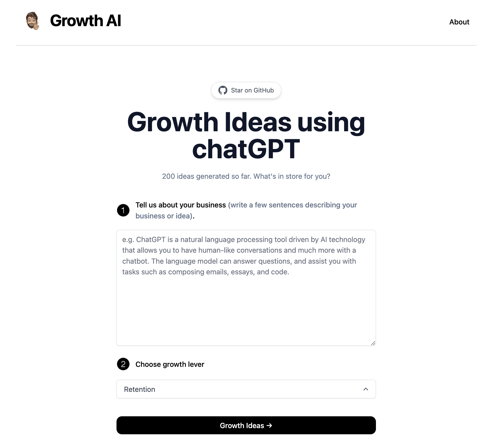

# [Growth AI](https://growth-ai.amankalra.com/)

This project generates growth ideas with examples using AI.

[](https://growth-ai.amankalra.com/)

## How it works

This project uses the [ChatGPT API](https://openai.com/api/) and [Vercel Edge functions](https://vercel.com/features/edge-functions) with streaming. It constructs a prompt based on the user input and the growth lever selected, sends it to the chatGPT API via a Vercel Edge function, then streams the response back to the application.


## Running Locally

After cloning the repo, go to [OpenAI](https://beta.openai.com/account/api-keys) to make an account and put your API key in a file called `.env`.

Then, run the application in the command line and it will be available at your local host.

```bash
npm run dev
```

## Share local 

[Loophole.Cloud](https://loophole.cloud/) allows you to make your Web application public without actually deploying on a cloud service. It provides a user-friendly domain that you can share with your remote users/friends/teammates to try/use your WebApp. What's best, these local tunnedl websites come with an HTTPS certificate. 
